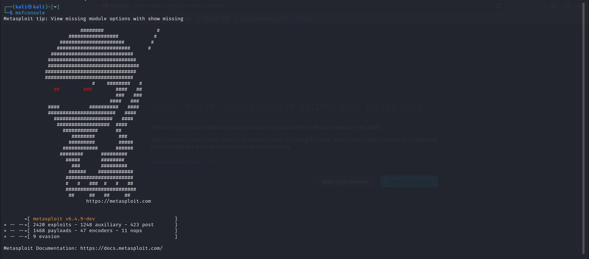
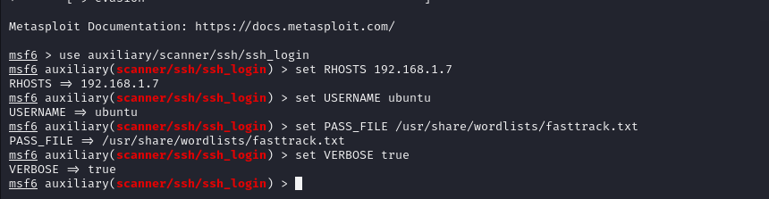
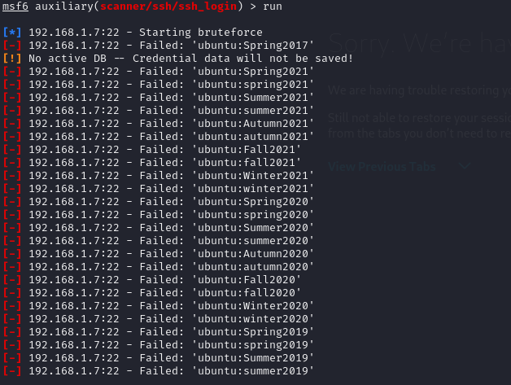
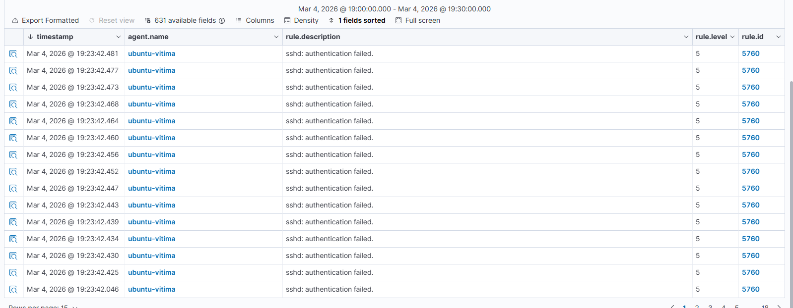
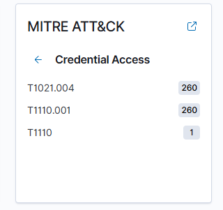
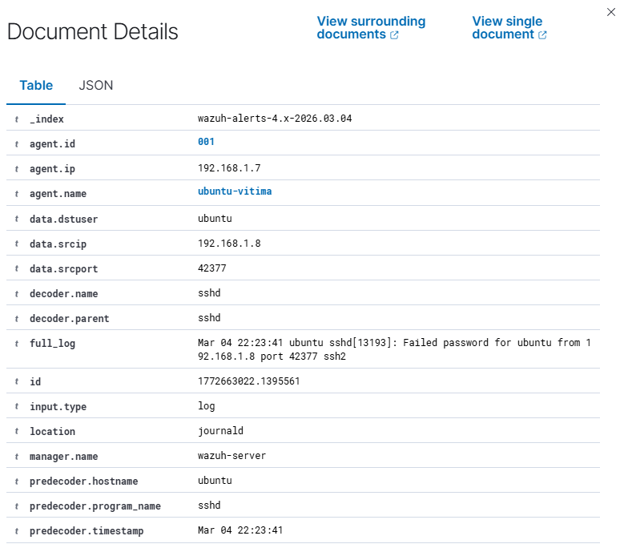
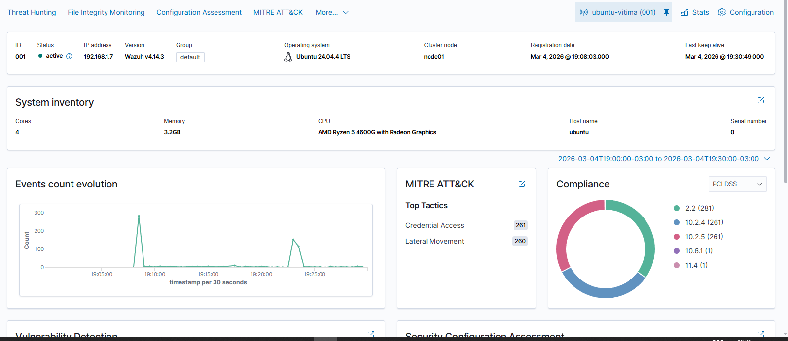

# Laboratório de Detecção de Ataque bruteforce + uso de Wazuh SIEM

Este projeto demonstra a implementação de um ambiente de monitoramento de segurança utilizando o **Wazuh (SIEM/XDR)** para detectar ataques de força bruta (Brute-Force) direcionados ao serviço SSH de um servidor Ubuntu.

## Arquitetura do Ambiente
O laboratório foi construído usando as seguintes **VMs**:

* **SIEM:** Wazuh em uma instância OVA.
* **Vítima:** Ubuntu Server com o serviço OpenSSH instalado.
* **Atacante:** Kali Linux com o framework Metasploit.

---

## Etapas de Implementação

### 1. Preparação do Alvo (Vítima)
Para simular um ambiente real, instalei o servidor SSH no Ubuntu para permitir acessos remotos usando o seguinte comando:
```bash
sudo apt update && sudo apt install openssh-server -y
```
## 2. Configuração do Wazuh
A comunicação entre o Ubuntu e o Wazuh foi estabelecida através do agente oficial. Como a VM não suportava copiar/colar nativo, utilizei um túnel SSH do terminal local (Windows CMD) para configurar o agente remotamente:
- Registro do agente via interface web do Wazuh.
- Instalação e ativação dos serviços:

   ```bash
  sudo systemctl daemon-reload
  sudo systemctl enable wazuh-agent
  sudo systemctl start wazuh-agent
  ```
### 3. Red Team
Utilizei o Metasploit Framework no Kali Linux para realizar um ataque de força bruta no serviço SSH do Ubuntu, utilizando uma wordlist padrão (fasttrack.txt).



Utilizei os seguintes comandos para me conectar a vitima
 ```bash
use auxiliary/scanner/ssh/ssh_login
set RHOSTS [IP_DA_VITIMA]
set USERNAME ubuntu
set PASS_FILE /usr/share/wordlists/fasttrack.txt
set VERBOSE true
 ```


Após esses comandos rodei o comando **RUN** para iniciar a simulação do ataque



## 4. Análise dos resultado - Blue Team

4.1  - Detecção de Anomalia: O Wazuh registrou um pico imediato no volume de logs de autenticação.




4.2 - Mapeamento MITRE ATT&CK: O sistema classificou o ataque como T1110 (Brute Force).



4.3 Identificação do Atacante: Através da análise detalhada (data.srcip), foi possível identificar o IP da máquina Kali e o usuário alvo (ubuntu).



**Importante citar que o Wazuh elevou a gravidade do alerta para Nível 10 após detectar múltiplas falhas consecutivas, diferenciando um erro de digitação comum de uma tentativa real de invasão.**

A seguir também deixo o print do dashboard do Wazuh após o ataque:



## 5. Conclusão

Este projeto demonstrou na prática o ciclo de vida de um incidente: desde a vulnerabilidade exposta (SSH) até a detecção e análise técnica via SIEM. O laboratório reforçou conceitos de redes, Linux, segurança ofensiva e monitoramento defensivo.
